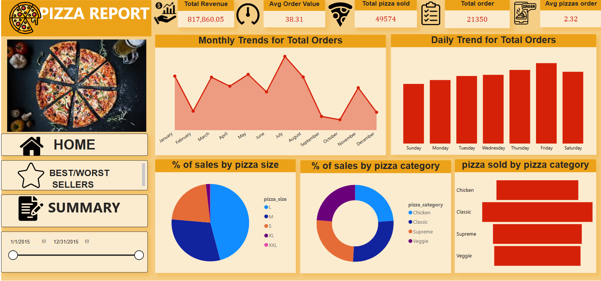
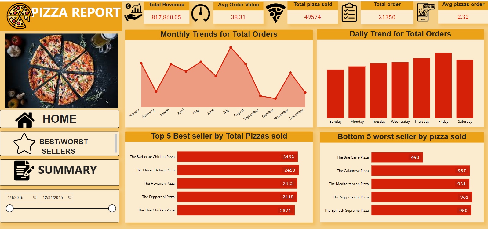
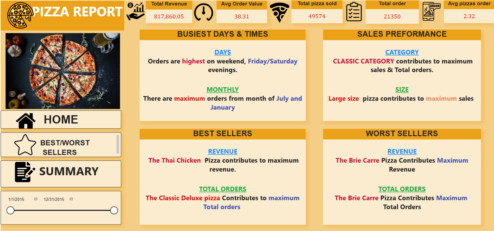

# Pizza Sales Dashboard

## Overview
This repository contains a comprehensive pizza sales dashboard created to visualize and analyze the performance of various pizza sales metrics. The dashboard provides insights into total revenue, average order value, total pizzas sold, and more. It also highlights the best and worst-selling pizzas, busiest times, and sales performance by category and size.

## Features
- **Total Revenue**: Displays the total revenue generated from pizza sales.
- **Average Order Value**: Shows the average value of each order.
- **Total Pizzas Sold**: Indicates the total number of pizzas sold.
- **Total Orders**: The total count of orders placed.
- **Average Pizzas per Order**: Average number of pizzas per order.

## Visualizations
1. **Monthly Trends for Total Orders**: Line chart showing the trend of total orders each month.
2. **Daily Trend for Total Orders**: Bar chart depicting the daily trend of total orders.
3. **% of Sales by Pizza Size**: Pie chart representing the percentage of sales by different pizza sizes.
4. **% of Sales by Pizza Category**: Pie chart showing the percentage of sales by pizza category.
5. **Pizza Sold by Pizza Category**: Bar chart displaying the number of pizzas sold by each category.
6. **Top 5 Best Sellers by Total Pizzas Sold**: Bar chart of the top 5 best-selling pizzas.
7. **Bottom 5 Worst Sellers by Pizza Sold**: Bar chart of the bottom 5 worst-selling pizzas.
8. **Busiest Days & Times**: Information on the busiest days and times for pizza orders.
9. **Sales Performance**: Insights into the best-performing pizza categories and sizes.
10. **Best Sellers**: Details about the pizzas that generate the most revenue and orders.
11. **Worst Sellers**: Information about the pizzas that contribute the least to revenue and orders.

## Screenshots

### Home Dashboard


### Best/Worst Sellers


### Summary


## How to Use
1. Clone the repository to your local machine:
    ```bash
    git clone https://github.com/yourusername/pizza-sales-dashboard.git
    ```
2. Open the project in your preferred IDE.
3. Ensure you have the necessary dependencies installed.
4. Run the dashboard application.

## Data Source
The data used in this dashboard is fictional and created for demonstration purposes.

## License
This project is licensed under the MIT License. See the [LICENSE](LICENSE) file for details.

## Acknowledgements
- Special thanks to the creators of the tools and libraries used in this project.

## Contact
For any questions or feedback, please contact [gdeepareddy2000@gmail.com](mailto:gdeepareddy2000@gmail.com).
